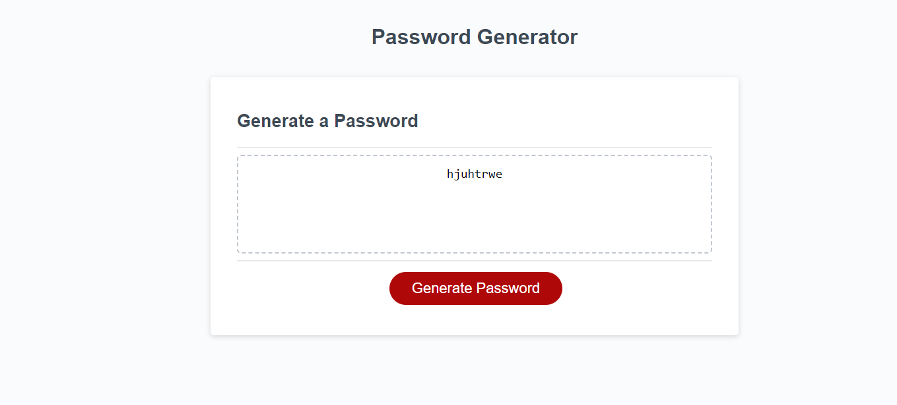

# Password-Generator-Week-3
The Mock Password Generator is a simple JavaScript-based web application that allows users to generate secure passwords.

## Table of contents

- [General info](#General-Info)
- [Deployment](#Deployment)
- [Summary](#Summary)

Deployed link: https://devop-a.github.io/Password-Generator-Week-3/

Landing page 

## Technologies

Project is created with:

- [JavaScript](https://www.javascript.com/)

## Deployment

Download the repository

- Use the deployed link
- Deployed link: https://devop-a.github.io/Password-Generator-Week-3/

## Summary

- This project is a mock-JS project that shows variable generations. 

## Authors

- Austin Wilson 

## License

- See License page
